# GeoGebra MCP Server

让 Claude Code、Codex 和其他 MCP 客户端操控 GeoGebra——绘制几何构造、函数图像、3D 图形、动态机构，保存 `.ggb`，导出 `.png`。默认使用 Web Runtime，无需安装 GeoGebra 桌面版。

> 本项目不是要替代 GeoGebra，而是把 GeoGebra 变成 AI 可以可靠调用的数学可视化后端。

<p align="center">
  <a href="#快速开始">快速开始</a> ·
  <a href="#配置-ai-客户端">配置客户端</a> ·
  <a href="#mcp-工具">MCP 工具</a> ·
  <a href="#常见问题">常见问题</a> ·
  <a href="#贡献">贡献</a>
</p>

---

## 能做什么

| 场景 | 示例 |
|------|------|
| 函数图像 | `f(x)=sin(x)`, `g(x)=cos(x)`, 交点, 切线 |
| 平面几何 | 三角形, 外接圆, 角平分线, 轨迹, 位似变换 |
| 3D 图形 | 空间曲线, 平面, 球面, 多面体 |
| 机构简图 | 曲柄摇杆, 曲柄滑块, 四连杆, 缩放机构 |
| 数据图表 | 条形图, 直方图, 回归曲线 |
| 动态动画 | 滑块驱动旋转, 轨迹追踪, 自动播放 |

---

## 架构

<p align="center">
  
</p>

---

## 环境要求

- **Python 3.10+**
- **Node.js v16+** 和 npm
- 支持 MCP stdio 的 AI 客户端（Claude Code / Codex / …）
- 首次使用 Web Runtime 需要网络访问 GeoGebra CDN；Puppeteer 会自动下载 Chromium

Windows、macOS、Linux 均可使用。

> **可选：**如需使用桌面版后端（`GEOGEBRA_BACKEND=desktop`），则需要 [GeoGebra Classic 6](https://www.geogebra.org/download)。

## 默认 Web Runtime

**GeoGebra Classic 6 桌面版不再是必需的。** 默认情况下，MCP Server 会自动启动 Chromium，加载 GeoGebra 网页版，通过 GeoGebra Apps API 控制绘图。用户无需安装或配置任何 GeoGebra 桌面软件。

```bash
GEOGEBRA_BACKEND=auto   # 默认：优先 Web，失败时回落 desktop
GEOGEBRA_BACKEND=web    # 仅使用 Web Runtime
GEOGEBRA_BACKEND=desktop # 仅使用 Classic 6 CDP 桌面版
GEOGEBRA_WEB_HEADLESS=1 # 无头模式（默认）；=0 显示浏览器窗口
GEOGEBRA_WEB_BUNDLE=cdn # 默认：从 GeoGebra CDN 加载；=local 使用离线 bundle
```

> 首次使用 Puppeteer 会自动下载 Chromium。  
> 离线模式使用 GeoGebra 官方 web bundle。发布包含该 bundle 的软件包前，请查阅 [GeoGebra 许可证](https://www.geogebra.org/license)。

### 离线 Web Runtime

下载 GeoGebra Math Apps Bundle 到本地缓存，实现完全离线运行：

```bash
# 下载离线 bundle
python scripts/setup_geogebra_web_bundle.py

# 验证 bundle 完整性
python scripts/setup_geogebra_web_bundle.py --check
```

使用离线模式：

```bash
# Windows
$env:GEOGEBRA_BACKEND="web"
$env:GEOGEBRA_WEB_BUNDLE="local"
geogebra-mcp-doctor

# macOS / Linux
GEOGEBRA_BACKEND=web GEOGEBRA_WEB_BUNDLE=local geogebra-mcp-doctor
```

> 适合学校机房、离线机器或网络受限环境。普通用户无需下载 bundle，默认 CDN 模式即可。

---

## 快速开始

### 1. 自然语言自动安装（推荐）

仿照 MATLAB Agentic Toolkit 的方式，普通用户可以不手动编辑 MCP JSON/TOML。

```bash
git clone https://github.com/123pc/Geogebra_mcp.git
cd Geogebra_mcp
```

然后在这个目录里启动 Claude Code、Codex 或其他 agent，对它说：

```text
Set up GeoGebra MCP
```

agent 会根据 [AGENTS.md](AGENTS.md) 和 `skills/geogebra-setup` 的指导运行：

```bash
python scripts/setup_geogebra_mcp.py
```

这个脚本会自动完成：

- 安装 Node 依赖：`npm install`
- 安装 Python 包：`python -m pip install -e .`
- 写入 Claude Code 全局 MCP 配置
- 写入 Codex 全局 MCP 配置
- 注册本仓库提供的 skills
- 运行 `geogebra-mcp-doctor` 做环境诊断

完成后重启 agent，并在任意项目目录中验证：

```text
Use GeoGebra MCP to check status and draw a triangle.
```

如果只想配置某一个客户端：

```bash
python scripts/setup_geogebra_mcp.py --agent claude
python scripts/setup_geogebra_mcp.py --agent codex
```

### 2. 手动安装

```bash
git clone https://github.com/123pc/Geogebra_mcp.git
cd Geogebra_mcp
npm install                  # Node 依赖（puppeteer，含 Chromium）
python -m pip install -e .   # Python 依赖 + 暴露 CLI 命令
```

> `npm install` 不可省略——Node 守护进程依赖 `puppeteer`（自动管理 Chromium 浏览器）。  
> 也可运行 `python install_wizard.py` 进行交互式安装向导。

### 3. 环境诊断

```bash
geogebra-mcp-doctor
# 如果命令不在 PATH 中，改用：
python -m geogebra_mcp.doctor
```

预期输出（Web Runtime 默认）：

```text
[OK] python: 3.13.5
[OK] node: v22.17.1
[OK] npm
[OK] daemon_js: .../geogebra_mcp/geogebra_daemon.js
[OK] package_json: .../geogebra_mcp/package.json
[OK] backend: auto
[OK] web_assets: .../geogebra_mcp
[OK] puppeteer: installed
[SKIP] geogebra_install: not required for backend=auto
[SKIP] cdp_port: not required for backend=auto
```

> `geogebra_install` 和 `cdp_port` 被跳过是正常的——Web Runtime 不需要 GeoGebra 桌面版。

### 4. 可选：Desktop 后端（GeoGebra Classic 6 CDP）

仅当设置 `GEOGEBRA_BACKEND=desktop` 时才需要以下步骤。Web Runtime 用户可跳过。

每次使用前需要以调试模式启动 GeoGebra Classic 6：

**Windows：** 双击 `start_geogebra.bat`，或在终端中执行：

CMD：
```cmd
for /d %v in ("%LOCALAPPDATA%\GeoGebra_6\app-*") do start "" "%~fv\GeoGebra.exe" --remote-debugging-port=9222
```

PowerShell：
```powershell
$ggb = Get-ChildItem "$env:LOCALAPPDATA\GeoGebra_6\app-*\GeoGebra.exe" | Sort-Object -Descending | Select-Object -First 1; Start-Process $ggb.FullName "--remote-debugging-port=9222"
```

**macOS：**
```bash
open -a "GeoGebra Classic 6" --args --remote-debugging-port=9222
```

**Linux：**
```bash
geogebra-classic --remote-debugging-port=9222
```

### 5. 配置 AI 客户端

**推荐：运行自动配置脚本（无需手动编辑 JSON）：**

```bash
python scripts/setup_geogebra_mcp.py
```

该脚本自动完成：安装依赖 → 写入 MCP 配置 → 注册 skills → 运行诊断。  
`--agent claude` 仅配置 Claude Code，`--agent codex` 仅配置 Codex。

**手动配置：** 在你的 MCP 配置文件中加入：

```json
{
  "mcpServers": {
    "geogebra": {
      "command": "python",
      "args": ["-m", "geogebra_mcp.server"]
    }
  }
}
```

> `python -m geogebra_mcp.server` 在任何目录都能运行，不依赖仓库路径。  
> `pip install -e .` 后也可直接用 `geogebra-mcp-server`（如果 Scripts 目录在 PATH 中）。

Claude Code 用户还需在 `settings.json` 中添加：

```json
{ "enabledMcpjsonServers": ["geogebra"] }
```

重启客户端后生效。

---

## MCP 工具

### 连接与状态

| 工具 | 说明 |
|------|------|
| `geogebra_status` | 检查 GeoGebra 连接状态 |
| `geogebra_version` | 查看 MCP Server 版本 |
| `geogebra_help` | 获取命令/机构/动画参考（`topic="commands"\|"mechanisms"\|"animation"`） |

### 命令执行

| 工具 | 推荐度 | 说明 |
|------|--------|------|
| `geogebra_run_commands` | 推荐 | 结构化数组执行，适合 AI 客户端 |
| `geogebra_create_construction` | 推荐 | 结构化对象执行，带样式和动画 |
| `geogebra_exec` | 备选 | 单条命令执行 |
| `geogebra_batch` | 兼容 | JSON 字符串批量执行，兼容旧客户端 |
| `geogebra_draw_mechanism` | 兼容 | JSON 字符串机构绘制，兼容旧客户端 |

### 视图与外观

| 工具 | 说明 |
|------|------|
| `geogebra_new_construction` | 清空当前构造 |
| `geogebra_set_view` | 设置视图：`G`（几何）、`AG`（代数+几何）、`3D`、`T`（表格） |
| `geogebra_set_appearance` | 颜色、线宽、点大小、标签可见性 |
| `geogebra_animate` | 启动/停止滑块动画，设置速度 |
| `geogebra_get_objects` | 获取当前构造对象列表（用于自验收） |

### 输出

| 工具 | 说明 |
|------|------|
| `geogebra_save` | 保存为 `.ggb` 文件 |
| `geogebra_export_png` | 导出当前视图为 `.png` |

---

## 给 AI 的调用流程

AI 在处理绘图请求时应遵循以下步骤：

1. **确认输出路径** — 如果用户没指定保存位置，先问「文件保存在哪里？」
2. **检查连接** — `geogebra_status`
3. **未连接时提示** — Web Runtime 会自动启动 Chromium；Desktop 后端需告知用户双击 `start_geogebra.bat` 启动 GeoGebra
4. **设置视图** — `geogebra_set_view`
5. **清空画布**（如需） — `geogebra_new_construction`
6. **发送命令** — 用 `geogebra_run_commands` 或 `geogebra_create_construction`
7. **自验收** — `geogebra_get_objects`，确认对象数 >= 3
8. **动画**（如需） — `geogebra_set_appearance` 使滑块可见 + `geogebra_animate` 自动播放
9. **保存** — `geogebra_save`

---

## 示例

### 用自然语言

> "画 y=sin(x) 和 y=cos(x)，标出交点，导出到 D:/output/sin_cos.png"

### 曲柄摇杆机构

```json
{
  "name": "crank_rocker",
  "design": {
    "perspective": "G",
    "commands": [
      "O1=(0,0)", "O2=(6,0)", "alpha=30 deg",
      "A=O1+(2*cos(alpha),2*sin(alpha))",
      "c1=Circle(A,5)", "c2=Circle(O2,4)",
      "B=Intersect(c1,c2,1)",
      "crank=Segment(O1,A)", "coupler=Segment(A,B)",
      "rocker=Segment(B,O2)", "ground=Segment(O1,O2)"
    ],
    "styles": [
      {"label":"alpha","visible":true,"label_visible":true},
      {"label":"crank","color":[1,0,0],"thickness":6},
      {"label":"coupler","color":[0,0.2,1],"thickness":6},
      {"label":"rocker","color":[0,0.7,0.2],"thickness":6},
      {"label":"ground","color":[0,0,0],"thickness":5}
    ],
    "animate": "alpha",
    "speed": 0.5
  },
  "output_dir": "D:/output"
}
```

> 推荐使用 ASCII 标签（`alpha` 而非 `α`），避免不同客户端间的编码问题。

---

## Skills

仓库附带三套 skill，教 AI 更稳定地使用本 MCP：

| Skill | 用途 |
|-------|------|
| `skills/geogebra-master` | 教 AI 像 GeoGebra 专家一样作图——强制滑块可见、自动播放动画、自验收 |
| `skills/use-geogebra-mcp` | 教 AI 部署、配置、诊断本 MCP，以及离线 bundle 的使用 |
| `skills/geogebra-setup` | 教 AI 一键安装和配置本 MCP（`python scripts/setup_geogebra_mcp.py`） |

---

## 环境变量

| 变量 | 默认值 | 说明 |
|------|--------|------|
| `GEOGEBRA_BACKEND` | `auto` | 后端选择：`auto`（优先 Web）、`web`、`desktop` |
| `GEOGEBRA_WEB_HEADLESS` | `1` | Web Runtime 无头模式：`1`=是，`0`=显示浏览器窗口 |
| `GEOGEBRA_WEB_WIDTH` | `1200` | Web Runtime 视口宽度 |
| `GEOGEBRA_WEB_HEIGHT` | `800` | Web Runtime 视口高度 |
| `GEOGEBRA_WEB_BUNDLE` | `cdn` | Web Runtime 资源加载方式：`cdn`（在线）或 `local`（离线 bundle） |
| `GEOGEBRA_WEB_BUNDLE_PATH` | 平台默认 | 离线 bundle 缓存目录（覆盖默认路径） |
| `GEOGEBRA_CDP_PORT` | `9222` | Desktop 后端 CDP 远程调试端口 |
| `GEOGEBRA_RESTART_EXISTING` | `0` | Desktop 后端：设为 `1` 允许自动重启已有的 GeoGebra |

---

## 常见问题

### `connected: false`

**Web Runtime（默认）：** 检查网络是否能访问 GeoGebra CDN，Puppeteer/Chromium 是否已安装。运行 `node scripts/smoke_web_runtime.js` 进行诊断。如果 CDN 不可达（如学校机房、离线环境），下载离线 bundle 后设置 `GEOGEBRA_WEB_BUNDLE=local` 即可（见[离线 Web Runtime](#离线-web-runtime)）。

**Desktop 后端（`GEOGEBRA_BACKEND=desktop`）：** GeoGebra 未以调试模式运行。确保已用 `--remote-debugging-port=9222` 启动（见[快速开始](#快速开始)第 4 步）。

### 动画不动

检查三点：
1. 是否创建了角度滑块（`alpha=30 deg`）
2. 运动点是否依赖滑块（`A=O+(2*cos(alpha),2*sin(alpha))`）
3. 是否调用了 `geogebra_set_appearance` 使滑块**可见** + `geogebra_animate(label="alpha", animate=true)`
4. 使用 `geogebra_create_construction` 可自动处理以上步骤

### AI 画的图和实际不符 / 空白

让 AI 调用 `geogebra_get_objects` 自验收。如果对象数为 0，AI 应重试而非声称"完成"。

### 已经打开的 GeoGebra 能接管吗？

**Desktop 后端：**不能。必须关闭后以 `--remote-debugging-port=9222` 重新启动。Web Runtime 不受此限制，它会自动启动独立的 Chromium 实例。

### 能在 macOS / Linux 上用吗？

可以。三平台均已适配。

### 为什么要用 `alpha` 而非 `α`？

希腊字母在部分客户端、终端或 JSON 日志中可能出现编码异常。推荐默认使用 ASCII 名称以提高普适性。

---

## 更新

在项目目录下运行：

```bash
python update.py
```

该脚本自动执行 `git pull` → `npm install` → `pip install -e .` → 同步 MCP 配置和 skills，无需重新 clone。

---

## 开发

```bash
# 运行测试
python -m pytest -q                     # Python (64 tests)
node tests/test_daemon_protocol.js      # Node (27 tests)

# Web Runtime 冒烟测试
node scripts/smoke_web_runtime.js                    # CDN 模式
GEOGEBRA_WEB_BUNDLE=local node scripts/smoke_web_runtime.js  # 离线模式

# 离线 bundle 管理
python scripts/setup_geogebra_web_bundle.py          # 下载
python scripts/setup_geogebra_web_bundle.py --check  # 验证

# 构建 wheel
python -m build --wheel
```

---

## 贡献

欢迎所有形式的贡献！

- 在 [Issues](https://github.com/123pc/Geogebra_mcp/issues) 中报告 bug 或提出功能建议
- 提交 Pull Request 改进代码、文档或 skill
- 测试并适配更多 AI 客户端（Codex、DeepSeek TUI 等）
- 分享你用它绘制的有趣构造

### 当前适配状态

| 客户端 | 状态 |
|--------|------|
| Claude Code | 已测试 |
| Codex | 适配中 |
| DeepSeek TUI | 计划中 |
| 其他 MCP 客户端 | 欢迎测试反馈 |

---

## 许可证

MIT © 2026 [GeoGebra MCP contributors](https://github.com/123pc/Geogebra_mcp/graphs/contributors)
